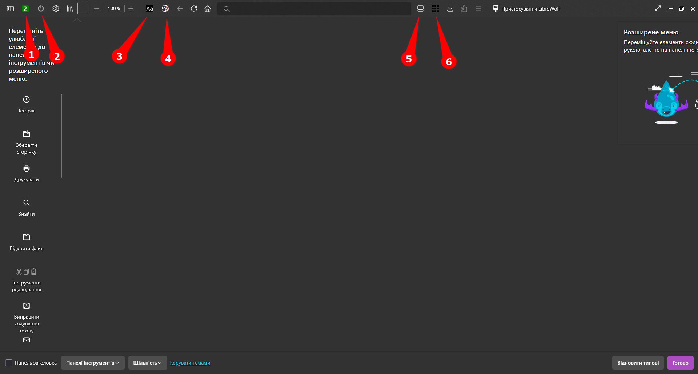
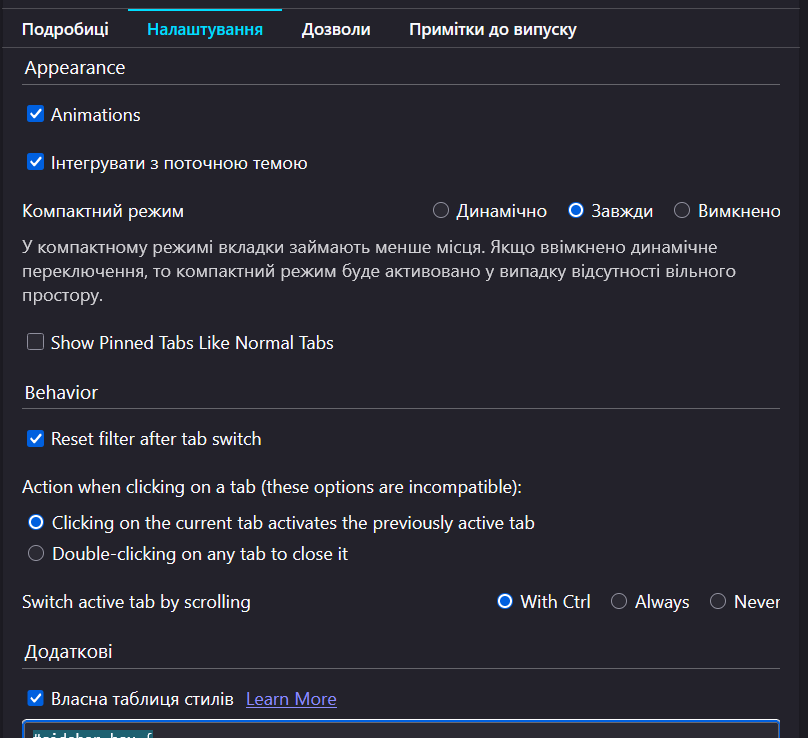

# userChrome.css-oneline

Я не програміст. Робив за допомогою чат-гпт 3.5 - дуже давно. Тому не вбачав сенсу ділитись, та й була думка дороблювати. І зараз подібне вже з'явилося по дефолту в файрфокс, саме через це я помітив що моє мені дійсно подобається більше, не повністю але всеж. Через що вирішив зробити бекап.

Колись давно, за основу взяв наступний код:

[https://github.com/MrOtherGuy/firefox-csshacks/blob/master/chrome/navbar_tabs_oneliner_menu_buttons_on_right.css/](https://github.com/MrOtherGuy/firefox-csshacks/blob/master/chrome/navbar_tabs_oneliner_menu_buttons_on_right.css/)

Я весь час запускав на вікнах, тому нічого не адаптував для яблока чи Linux.

## Рекомендую розширення:

- 1: [Tab counter автор WaldiPL](https://addons.mozilla.org/uk/firefox/addon/tabcounter-1/): Просто зручно бачити кількість вкладок.
    
- 2: [Auto Tab Discard автор tlintspr](https://addons.mozilla.org/uk/firefox/addon/auto-tab-discard/): Вивантажувати вкладки самому або автоматично. У мене вкладок в середньому відкрито 50-70. Через що LibreWolfe Portable підвисає.  
- 3: [Dark Background and Light Text автор Mikhail Khvoinitsky](https://addons.mozilla.org/uk/firefox/addon/dark-background-light-text/): Перефарбовує любу веб-сторінку. Люблю це. Мої налаштування:

|     | Параметр                               | Значення             |
| --- | -------------------------------------- | -------------------- |
|     | Default method of changing page colors | Stylesheet processor |
|     | Default foreground color               | #BAB8AE              |
|     | Default background color               | #30302E              |
|     | Default link color                     | #7bd5ff              |
|     | Default visited link color             | #ff7dff              |
|     | Default active link color              | #ff6868              |
|     | Default selection color                | #8080ff              |

- 4: [NoScript Security Suite автор Giorgio Maone](ns.mozilla.org/uk/firefox/addon/noscript/): Більшість нав'язливої реклами та відстежуваних штук - йде саме від скріптів. Те що не може заблокувати "uBlock Origin", просто не запустить це розширення.
- "Sideberry" або "Tab Center Reborn" (довгий час я саме ним користувався, але донедавна встановив Sideberry).

**Налаштування "Tab Center Reborn":**

**Власна таблиця стилів "Tab Center Reborn":**
```
#sidebar-box {
  max-width: 192px;
}
     /* 
.tab.discarded {
  font-style: italic;
}
    */
.tab.discarded .tab-title {
  opacity: 0.65; /* default is 0.5 */
}
.tab.discarded .tab-meta-image {
  opacity: 0.6; /* default is 0.45 */
}
.tab.unread {
  color: green;
}
#tablist-wrapper:not(.shrinked) #tablist .tab-meta-image,
#tablist-wrapper:not(.shrinked) #pinnedtablist:not(.compact) .tab-meta-image {
  background-size: 700% !important;
}
#sidebar-header {
  background: #0C0C0D;
  border-bottom: none !important;
}
#sidebar-splitter {
  border-right-color: #0C0C0D !important;
  border-left-color: #0C0C0D !important;
}
#sidebar-switcher-target {
  filter: invert(100%);
}

#topmenu,
#sidebar-close {
  display: none;
}

```
- 5: Список усіх вкладок - це дефолтний функціонал, той що з права поряд з кнопками "згорнути, розширити, закрити", але в другому місці, з іншою іконкою. Тому просто звернув увагу.
- 6: [Simple Tab Groups автор Drive4ik](https://addons.mozilla.org/uk/firefox/addon/simple-tab-groups/): Як я вже раніше говорив, користувався "Tab Center Reborn", і це розширення добре доповнювало зручність користування. Але востаннє почав пробувати "Sideberry" - і вже з ним це розширення не працює. А шкода, це те що має бути в браузері за замовчуванняи. Я знаю про контейнери, але це трохи інше, мені лінь перезаходити +задовбує антиспам системи ("докажіть що ви не робот").

## Не забудьте розставити іконки на панелі.

