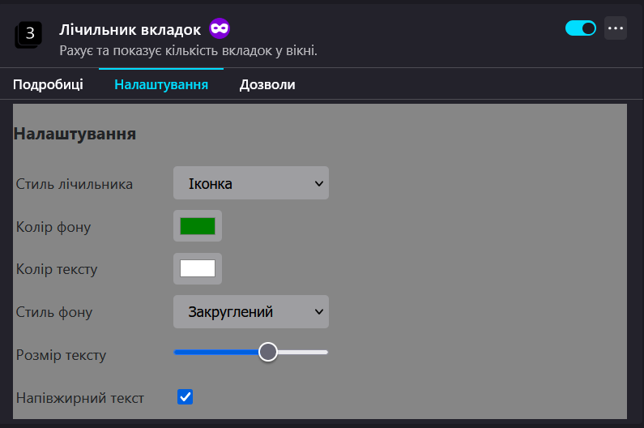

# userChrome.css-oneline

Я не програміст. Робив за допомогою чат-гпт 3.5 - дуже давно. Тому не вбачав сенсу ділитись, та й була думка дороблювати. І зараз подібне вже з'явилося по дефолту в файрфокс, саме через це я помітив що моє мені дійсно подобається більше, не повністю але всеж. Через що вирішив зробити бекап.

Опис потребує допису\редагування. Все ж основу для перемикання в одну лінію я брав з бібліотеки десь тут на гітхабі. Це було дуже давно, тому будь ласка якщо зрозуміли і знаєте де це - напишіть куди небудь.

Треба якось в нові генератори тексту запхнути код, щоб він передивився його. Може помилки якісь є, що може торзити браузер.

Коротше це типу бекап, але якщо Вам сподобалось - будь ласка користуйтесь.

Для відтворення вигляду подібно до мого - рекомендую розширення:

- 1: [Tab counter автор WaldiPL](https://addons.mozilla.org/uk/firefox/addon/tabcounter-1/): Просто зручно бачити кіл-сть вкладок.
    
- 2: [Auto Tab Discard автор tlintspr](https://addons.mozilla.org/uk/firefox/addon/auto-tab-discard/): Вивантажувати самому або автоматично. У мене вкладок в середньому відкрито 50-70. Через що LibreWolfe Portable підвисає.
    
- 3: [Dark Background and Light Text автор Mikhail Khvoinitsky](https://addons.mozilla.org/uk/firefox/addon/dark-background-light-text/): Перефарбовує любу веб-сторінку. Люблю це. Мої налаштування:
    
|     | Параметр                               | Значення             |
| --- | -------------------------------------- | -------------------- |
|     | Default method of changing page colors | Stylesheet processor |
|     | Default foreground color               | #BAB8AE              |
|     | Default background color               | #30302E              |
|     | Default link color                     | #7bd5ff              |
|     | Default visited link color             | #ff7dff              |
|     | Default active link color              | #ff6868              |
|     | Default selection color                | #8080ff              |

- 4: [NoScript Security Suite автор Giorgio Maone](ns.mozilla.org/uk/firefox/addon/noscript/): Більшість нав'язливої реклами та відстежуваних штук - йде саме від скріптів. Те що не може заблокувати "uBlock Origin", просто не запустить це розширення.

- "Sideberry" або "Tab Center Reborn" (довгий час я саме ним користувався, але донедавна встановив Sideberry).
    
- 5: Список усіх вкладок - це дефолтний функціонал, той що з права поряд з кнопками "згорнути, розширити, закрити", але в другому місці, з іншою іконкою. Тому просто звернув увагу.

А також треба розставити іконки на панелі.
